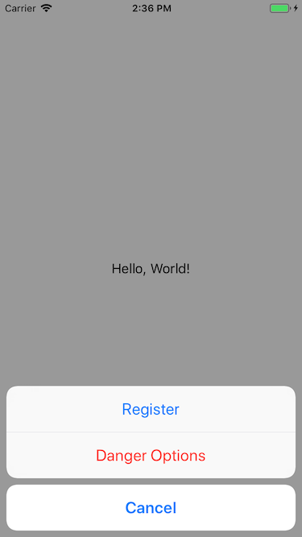

展示一个多选项对话框。

## Preview



## Sample

```typescript
const actionSheet = new UIActionSheet
actionSheet.addRegularAction("Register", () => {
    // callback
})
actionSheet.addDangerAction("Danger Options", () => {
    // callback
})
actionSheet.addCancelAction("Cancel", () => {
    // callback
})
actionSheet.show()
```

## API

### Instance Fields

#### message: `string | undefined`
设置对话框的标题。

### Instance Methods

#### addRegularAction(title: `string`, acitonBlock?: `() => void`): `void`
添加一个普通选项。

#### addDangerAction(title: `string`, acitonBlock?: `() => void`): `void`
添加一个标红选项。

#### addCancelAction(title: `string`, acitonBlock?: `() => void`): `void`
添加一个取消选项。

#### show(): `void`
弹出对话框。