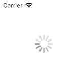

展示一个 Loading 指示器。

## Preview



## Sample

```typescript
const activityIndicatorView = new UIActivityIndicatorView
activityIndicatorView.frame = { x: 44, y: 44, width: 88, height: 88 }
activityIndicatorView.color = UIColor.gray
activityIndicatorView.largeStyle = true
activityIndicatorView.startAnimating()
this.view.addSubview(activityIndicatorView)
```

## API

### Instance Fields

#### color: `UIColor`
指示器的颜色。

#### largeStyle: `boolean`
指定指示器为大样式。

#### animating: `boolean` *`readonly`*
获取当前指示器是否为活动状态。

### Instance Methods

#### startAnimating(): `void`
启动指示器。

#### stopAnimating(): `void`
停止指示器。