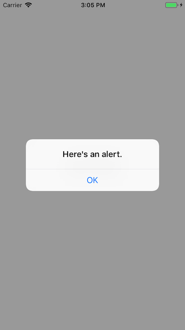

弹出一个告示对话框。

## Preview



## Sample

```typescript
const alert = new UIAlert("Here's an alert.", "OK")
alert.show(() => {
    // callback
})
```

## API

### constructor(message: `string`, buttonText?: `string`)
初始化对话框，必须提示一段文本用以显示。

### Instance Methods

#### show(completed?: `() => void`): `void`
弹出对话框。