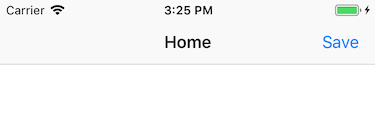

描述导航栏按钮。

## Preview



## Sample

```typescript
class MainViewController extends UIViewController {

    viewDidLoad() {
        super.viewDidLoad()
        this.title = "Home"
        const barButtonItem = new UIBarButtonItem()
        barButtonItem.title = "Save"
        barButtonItem.on("touchUpInside", () => {
            // callback
        })
        this.navigationItem.rightBarButtonItem = barButtonItem
    }

}
```

## API

### Instance Fields

#### title: `string | undefined`
指定按钮标题。

#### titleAttributes: `{ [key: UIAttributedStringKey]: any }`
指定按钮标题富文本属性。

#### image: `UIImage | undefined`
指定按钮图片（只能图片、文本标题二选一）。

#### tintColor: `UIColor`
指定标题或图片的颜色。

#### width: `number`
指定按钮的宽度（默认为 44 宽）。

#### customView: `UIView | undefined`
指定一个视图作为导航按钮。

### Events

#### "touchUpInside": `(sender: UIBarButtonItem) => void`
当按钮被点按时。