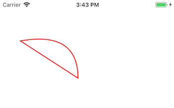

描述路径，一般配合 `CAShapeLayer` 使用。

## Preview



## Sample

```typescript
const bezierPath = new UIBezierPath
bezierPath.moveTo({ x: 44, y: 88 })
bezierPath.addQuadCurveTo({ x: 168, y: 168 }, { x: 168, y: 66 })
bezierPath.closePath()
this.shapeLayer.path = bezierPath
this.shapeLayer.lineWidth = 2
this.shapeLayer.strokeColor = UIColor.red
this.shapeLayer.fillColor = UIColor.clear
this.view.layer.addSublayer(this.shapeLayer)
```

## API

### Instance Methods

#### moveTo(toPoint: `UIPoint`): `void`
移动到指定点。

#### addLineTo(toPoint: `UIPoint`): `void`
画一条直线。

#### addArcTo(toCenter: `UIPoint`, radius: number, startAngle: `number`, endAngle: `number`, closewise: `boolean`): `void`
画一条弧线。

#### addCurveTo(toPoint: `UIPoint`, controlPoint1: `UIPoint`, controlPoint2: `UIPoint`): `void`
画一条三次曲线。

#### addQuadCurveTo(toPoint: `UIPoint`, controlPoint: `UIPoint`): `void`
画一条二次曲线。

#### closePath(): `void`
闭合。

#### removeAllPoints(): `void`
移除所有内容。

#### appendPath(path: `UIBezierPath`): `void`
添加另外一条路径到本路径中。
