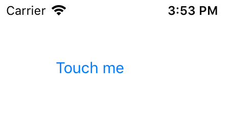

展示一个按钮。

## Extends

[UIView](./api-uikit-uiview.md)

## Extends

[UIView](./api-uikit-uiview.md)

## Preview



## Sample

```typescript
const button = new UIButton
button.frame = { x: 44, y: 44, width: 88, height: 44 }
button.setTitle("Touch me", UIControlState.normal)
button.on("touchUpInside", () => {
    // callback
})
this.view.addSubview(button)
```

## API

### constructor(isCustom?: `boolean` = false)
创建一个按钮，如果 `isCustom` 参数为 `true`，该按钮不会在按下时响应透明度修改等事件。

### Instance Fields

#### enabled: `boolean`
设置按钮的禁用状态。

#### selected: `boolean`
设置按钮的选中状态。

#### highlighted: `boolean` *`readonly`*
获取按钮的高亮状态。

#### tracking: `boolean` *`readonly`*
获取按钮的触摸状态，当用户正在触摸按钮时，该值为 `true`。

#### touchInside: `boolean` *`readonly`*
获取按钮的触摸状态，当用户正在触摸按钮并且手指处于按钮区域时，该值为 `true`。

#### contentVerticalAlignment: `UIControlContentVerticalAlignment`
设置按钮内容的垂直对齐方式。

#### contentHorizontalAlignment: `UIControlContentHorizontalAlignment`
设置按钮内容的水平对齐方式。

#### contentEdgeInsets: `UIEdgeInsets`
设置内容的布局调整值。

#### titleEdgeInsets: `UIEdgeInsets`
设置文本内容的布局调整值。

#### imageEdgeInsets: `UIEdgeInsets`
设置图片内容的布局调整值。

### Instance Methods

#### setTitle(title: `string | undefined`, state: `UIControlState`): `void`
设置按钮文本。

#### setTitleColor(color: `UIColor | undefined`, state: `UIControlState`): `void`
设置按钮文本颜色。

#### setTitleFont(font: `UIFont`): `void`
设置按钮文本字体。

#### setImage(image: `UIImage | undefined`, state: `UIControlState`): `void`
设置按钮图片。

#### setAttributedTitle(title: `UIAttributedString | undefined`, state: `UIControlState`): `void`
设置按钮富文本。

### Events

#### "touchDown": `(sender: UIButton) => void`
当按钮被按下时。

#### "touchDownRepeat": `(sender: UIButton) => void`
当按钮被再次按下时（双击）。

#### "touchDragInside": `(sender: UIButton) => void`
当按钮被按下后，手指处于按钮内，手指移动时。

#### "touchDragOutside": `(sender: UIButton) => void`
当按钮被按下后，手指处于按钮外，手指移动时。

#### "touchDragEnter": `(sender: UIButton) => void`
当按钮被按下后，手指移动的过程中，进入按钮时。

#### "touchDragExit": `(sender: UIButton) => void`
当按钮被按下后，手指移动的过程中，移出按钮时。

#### "touchUpInside": `(sender: UIButton) => void`
手指提起时，并且该手指位于按钮内。

#### "touchUpOutside": `(sender: UIButton) => void`
手指提起时，并且该手指位于按钮外。

#### "touchCancel": `(sender: UIButton) => void`
当触摸操作被中断时。