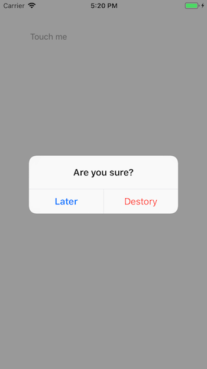

弹出一个确认对话框。

## Preview



## Sample

```typescript
const confirm = new UIConfirm("Are you sure?")
confirm.confirmTitle = "Destory"
confirm.cancelTitle = "Later"
confirm.show(() => {
    // confirm callback
}, () => {
    // cancel callback
})
```

## API

### constructor(message: string)
初始化对话框，必须提示一段文本用以显示。

### Instance Fields

#### confirmTitle: `string`
显示在确认按钮上的文本。

#### cancelTitle: `string`
显示在取消按钮上的文本。

### Instance Methods

#### show(completed?: `() => void`, cancelled?: `() => void`): `void`
弹出对话框。