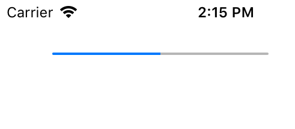

用于渲染一个进度条视图。

## Extends

[UIView](./api-uikit-uiview.md)

## Preview



## Sample

```typescript
const progressView = new UIProgressView
progressView.frame = {x: 44, y: 44, width: 180, height: 4}
progressView.setProgress(0.5, false)
this.view.addSubview(progressView)
```

## API

### Instance Fields

#### progress: `number`
当前进度值。

#### progressTintColor: `UIColor | undefined`
进度条前景色。

#### trackTintColor: `UIColor | undefined`
进度条背景色。

### Events

#### "valueChanged": (sender: UIProgressView) => void
进度值变化时触发。