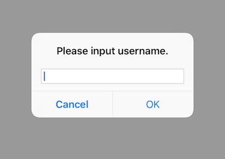

弹出一个内容输入对话框。

## Preview



## Sample

```typescript
const prompt = new UIPrompt("Please input username.")
prompt.placeholder = "Username."
prompt.confirmTitle = "OK"
prompt.cancelTitle = "Cancel"
prompt.show((text) => {
    // confirm callback
}, () => {
    // cancel callback
})
```

## API

### constructor(message: string)
初始化对话框，必须提示一段文本用以显示。

### Instance Fields

#### confirmTitle: `string`
确认按钮标题。

#### cancelTitle: `string`
取消按钮标题。

#### placeholder: `string`
输入框占位文本。

#### defaultValue: `string`
输入框默认文本。

### Instance Methods

#### show(completed: `(text: string) => void`, cancelled?: `() => void`): `void`
弹出对话框。