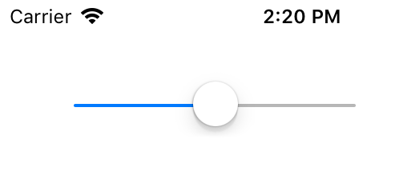

用于渲染一个滑杆视图。

## Extends

[UIView](./api-uikit-uiview.md)

## Preview



## Sample

```typescript
const slider = new UISlider
slider.frame = {x: 44, y: 44, width: 180, height: 44}
slider.setValue(0.5, false)
this.view.addSubview(slider)
```

## API

### Instance Fields

#### value: `number`
当前数值。

#### minimumValue: `number`
滑杆最小值。

#### maximumValue: `number`
滑杆最大值。

#### minimumTrackTintColor: `UIColor | undefined`
数值显示条前景色。

#### maximumTrackTintColor: `UIColor | undefined`
数值显示条背景色。

#### thumbTintColor: `UIColor | undefined`
滑块颜色。

### Events

#### "valueChanged": (sender: UISlider) => void
数值变化时触发。