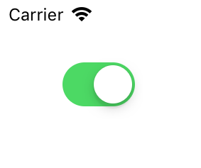

用于渲染一个开关按钮视图。

## Preview



## Sample

```typescript
const aSwitch = new UISwitch
aSwitch.frame = {x: 44, y: 44, width: 66, height: 44}
aSwitch.setOn(true, false)
this.view.addSubview(aSwitch)
```

## API

### Instance Fields

#### onTintColor: `UIColor | undefined`
状态为开时的前景色。

#### thumbTintColor: `UIColor | undefined`
滑块的颜色。

#### isOn: `boolean`
当前是否为开。

### Instance Methods

#### setOn(on: `boolean`, animated: `boolean`): `void`
设置开关状态。

### Events

#### "valueChanged": (sender: UISwitch) => void
开关状态变化时触发。