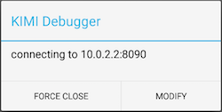

要在 Android 上调试，你需要先安装 Android Studio 和 Android SDK（由 Android Studio 附带）。

## 安装依赖

### Android Studio

务必安装最新版本 Android Studio，你可以在 https://developer.android.com（国内用户需翻墙） 下载并安装。

## 使用模拟器调试应用

### 运行应用

> 在使用模拟器调试应用前，请先创建模拟器。

使用 Android Studio，打开 ```platform/android``` 文件夹。静候 Android Studio 执行 Gradle 同步操作（这需要一些时间）。同步完成以后，在菜单栏选择『Run』 > 『Run 'app'』运行应用。

### 进入 Debug 模式

在『Run』 > 『Run 'app'』的模式下，应用默认使用 Debug 模式启动，你会看到类似的提示框。



这意味着，当前应用检测不到 Debugger 的存在，请检查是否已在工程目录下正确运行 ```npm run debug``` 命令。

* 点击『Modify Address』按钮可以修改 Debugger IP和端口，并重新尝试连接到调试器。
* 点击『Force Close』按钮可以退出 Debug 模式，此时，应用将使用 Bundle 中的 ```app.js``` 脚本运行应用。

在 Debug 模式下，应用会加载调试器中的脚本，并检查是否存在更新，按需重载。

## 使用真机调试应用

### 连接电脑

在使用真机调试应用前，先关闭所有模拟器。启用真机的『开发者模式』，使用 USB 数据线连接到电脑上。

### 运行应用

菜单栏选择『Run』 > 『Run 'app'』运行应用，选择你的机器。

### 连接调试器

在调试器 Alert 框中，选择『Modify Address』选项，并在弹出的对话框中输入电脑的 IP 地址和端口。

稍等片刻，真机就会接入到调试程序。

## 监听日志

在非 Debug 模式下，你需要借助 Android Studio 查看日志信息， 你可以通过『EDOLogger』关键词过滤日志结果。

在 Debug 模式下，在执行 ```npm run debug``` 的终端中，会打印接收到的日志。

## 断点调试

暂不支持断点调试，请使用打 Log 的方式调试应用。
