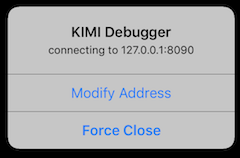

要在 iOS 中调试应用，你应当在 macOS 下进行开发，并安装必要依赖。

## 安装依赖

### Xcode

务必安装最新版本 Xcode，你可以在 Mac App Store 中搜索 Xcode 下载并安装。

### CocoaPods

CocoaPods 是一个依赖管理工具，XT 要求使用 1.4.0+ 版本的 CocoaPods，使用以下命令安装 CocoaPods。

```shell
> sudo gem install cocoapods
> pod setup
```

## 在模拟器调试应用

### 加载依赖

在正式运行应用前，你需要先加载依赖库，使用命令行进入 ```platform/ios``` 目录，执行命令。

```shell
pod install
```

### 运行应用

使用 Xcode 打开以 .xcworkspace 为后缀的文件，在 Xcode 中选择任意一个模拟器，运行应用。

### 进入 Debug 模式

在 Xcode > Run 的模式下，应用默认使用 Debug 模式启动，你会看到类似的提示框。



这意味着，当前应用检测不到 Debugger 的存在，请检查是否已在工程目录下正确运行 ```npm run debug``` 命令。

* 点击『Modify Address』按钮可以修改 Debugger IP和端口，并重新尝试连接到调试器。
* 点击『Force Close』按钮可以退出 Debug 模式，此时，应用将使用 Bundle 中的 ```app.js``` 脚本运行应用。

在 Debug 模式下，应用会加载调试器中的脚本，并检查是否存在更新，按需重载。

## 在真机中调试应用

### 注册开发者帐号

在要真机中调试应用，你必须先到 [Apple 开发者中心](https://developer.apple.com)注册并阅读相关协议。

### 添加真机证书

在 Xcode 中，选择工程文件，选择『General』选项卡，在『Signing』区域中选择你的 Apple ID 作为 Team。Xcode 会自动注册你的 iPhone 作为调试设备。

### 运行应用

在顶部设备选择器处，选择你的设备，并运行应用。

### 连接调试器

在调试器 Alert 框中，选择『Modify Address』选项，并在弹出的对话框中输入 Mac 的 IP 地址和端口。

稍等片刻，iPhone 就会接入到调用程序。

## 监听日志

在非 Debug 模式下，你需要借助 Xcode 或者 Mac 中的『控制台』应用查看日志信息。

在 Debug 模式下，在执行 ```npm run debug``` 的终端中，会打印接收到的日志。

## 断点调试

暂不支持断点调试，请使用打 Log 的方式调试应用。
